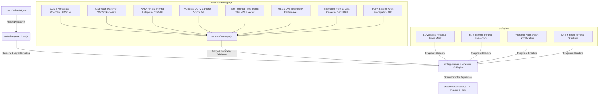

# 👁️ Visions-Ai × God's Eye View — Shang Tsung Assimilation Blueprint

> **Target Repository**:   
> **Host Node**:   
> **Agent Specialization**: Geospatial Intelligence & Visual Twin Architecture  
> **Status**: Cloned, Analyzed, Minted (–), and Synthesized  

---

## 🏛️ System Architecture Breakdown

The **God's Eye View** engine is a high-performance, modular geospatial digital twin designed around pure ESM JavaScript, CesiumJS WebGL rendering, and multi-source real-time sensor feeds.

---

## 🧩 Core Architectural Modules & File Matrix

| Subsystem | Key Files in `gods-eye-view/src/` | Visions-Ai Assimilation Path |
| :--- | :--- | :--- |
| **3D Rendering & Camera** | `src/app/viewer.js`, `src/app/application.js` | Embed Google Photorealistic 3D Tiles & Cesium globe into Visions-Ai dashboard with terrain elevation warming. |
| **Aerospace Sensor Loop** | `src/data/flights.js`, `src/data/militaryAwarenessEngine.js` | Real-time ADS-B transponder parser, military airframe classifier, and 1st-person Cockpit HUD mode. |
| **Maritime Telemetry** | `src/data/aisLiveVessels.js`, `src/data/aisStreamAdapter.js` | Persistent WebSocket (`wss://stream.aisstream.io/v0/stream`) ingestion with wake trajectory renderer. |
| **CCTV & Viewshed Frustum** | `src/data/cctv.js`, `src/data/cctvViewshed.js` | Geospatial camera catalog (Austin, London, Tokyo) with LOD frustum culling and 5-min cache-busting refresh. |
| **Environmental OSINT** | `src/data/firmsHeatmap.js`, `src/data/earthquakes.js` | NASA FIRMS VIIRS/MODIS infrared hotspot clustering + USGS live earthquake feeds. |
| **Critical Infrastructure** | `src/data/telegeographySubmarineCables.js`, `datacenters.geojsonl` | Subsea cable landing hubs & global hyperscale data center topologies mapped to energy grid nodes. |
| **Multimodal Voice Control** | `src/voice/gevRealtime.js`, `src/voice/gevActions.js` | Connect to Gemini Multimodal Live API / WebRTC for hands-free camera directing, waypoint routing, and entity querying. |
| **Atmospheric Shaders** | `src/styles/surveillance.js`, `src/styles/thermal.js` | WebGL post-processing shaders: Scope mask, FLIR thermal false-color, CRT scanlines, and Night Vision. |
| **Cinematic Scene Director** | `src/scenes/director.js` | Keyframe camera state interpolator (Cubic Spline) for 3D disaster reconstructions and OSINT video exports. |

---

## ⚡ Visions-Ai Integration Plan (Next Steps)

1. **Visions-Ai Geospatial Extension**:
   - Integrate `gods-eye-view` as the core 3D visualization frontend for Visions-Ai.
2. **Gemini 3.1 Multimodal Live Bridge**:
   - Adapt `src/voice/gevActions.js` to accept structured function calls directly from Gemini 3.1 Multimodal Live on the Observatory mesh.
3. **Automated Event Reconstructor**:
   - Expose an autonomous OSINT pipeline where Visions-Ai ingests USGS / NASA FIRMS alerts, pulls satellite imagery diffs, and constructs automated 3D flythrough forensics.
